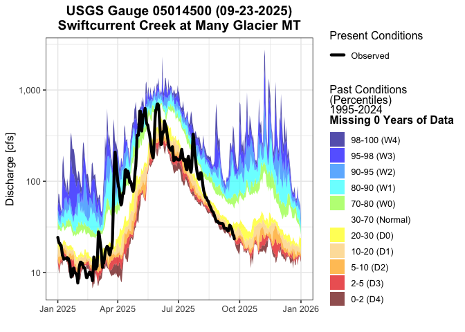
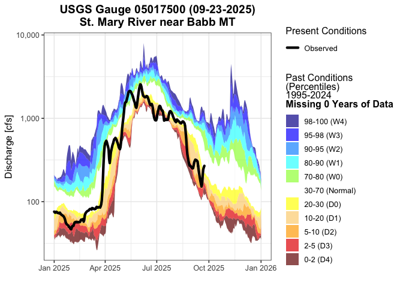

<!-- README.md is generated from README.Rmd. Please edit that file -->

# `usgs.discharge`: A simple package for calculating 30-year USGS discharge percentiles.

<!-- badges: start -->
<!-- badges: end -->

## Installation

You can install the development version of usgs.discharge from
[GitHub](https://github.com/mt-climate-office/usgs-discharge) with:

``` r
# install.packages("devtools")
devtools::install_github("mt-climate-office/usgs-discharge")
```

## How to Use

Get 30 years of data from a USGS gauge, and plot current conditions with
USDM drought categories.

``` r
library(usgs.discharge)
discharge <-  get_discharge("05014500")
make_climatology_plot(
 discharge,
  "Swiftcurrent Creek at Many Glacier MT",
  "05014500"
)
```



Below is an example of how to both create plots and an `sf` object with
current discharge conditions for the entire UMRB. **Note** that this
uses a `future` plan with all but 1 of your available cores. I don’t
know if there is a rate limiting scheme on the USGS API, but be careful
using more than ~20 cores. I only tested using 19 cores and didn’t run
into any issues:

``` r
library(usgs.discharge)

# Create a future plan for multicore processing. If you don't do this, everything
# will happen sequentially.
future::plan(future::multisession, workers = future::availableCores() -1)
stations <- get_gauges(clip_shp = usgs.discharge::domain)

# only use 5 stations for this example.
stations <- head(stations, 5)

# You can ignore the warning this spits out.
# We only get 3 stations as a result, because this function filters out stations
# that don't have a 30-year observation record.
discharge <- get_discharge_shp(stations)

# Make plots. You can specify an out_dir arguemnt to write the plots out to a folder:
# plots <- furrr::future_pmap(dat, make_climatology_plot, out_dir = "./plots")
plots <- furrr::future_pmap(discharge, make_climatology_plot) 
plots[[2]]
```



``` r

discharge_shp <- calc_discharge_anomalies(discharge)

print(discharge_shp)
#> Simple feature collection with 12 features and 5 fields
#> Geometry type: POINT
#> Dimension:     XY
#> Bounding box:  xmin: -113.6567 ymin: 48.79883 xmax: -113.3753 ymax: 48.94697
#> Geodetic CRS:  WGS 84
#> # A tibble: 12 × 6
#>    STAID    STANAME                          geometry time  value fillColor
#>  * <chr>    <chr>                         <POINT [°]> <chr> <dbl> <chr>    
#>  1 05014500 Swiftcurrent Creek … (-113.6567 48.79883) today 10.3  #FCD27E  
#>  2 05014500 Swiftcurrent Creek … (-113.6567 48.79883) 7      6.90 #FFAA00  
#>  3 05014500 Swiftcurrent Creek … (-113.6567 48.79883) 14     6.90 #FFAA00  
#>  4 05014500 Swiftcurrent Creek … (-113.6567 48.79883) 28    13.8  #FCD27E  
#>  5 05017500 St. Mary River near… (-113.4207 48.83304) today 31.0  #FFFFFF  
#>  6 05017500 St. Mary River near… (-113.4207 48.83304) 7     41.4  #FFFFFF  
#>  7 05017500 St. Mary River near… (-113.4207 48.83304) 14    41.4  #FFFFFF  
#>  8 05017500 St. Mary River near… (-113.4207 48.83304) 28    82.8  #32E1FA  
#>  9 05018500 St. Mary Canal at S… (-113.3753 48.94697) today 65.2  #FFFFFF  
#> 10 05018500 St. Mary Canal at S… (-113.3753 48.94697) 7     82.6  #32E1FA  
#> 11 05018500 St. Mary Canal at S… (-113.3753 48.94697) 14    91.3  #325CFE  
#> 12 05018500 St. Mary Canal at S… (-113.3753 48.94697) 28    82.6  #32E1FA
```
